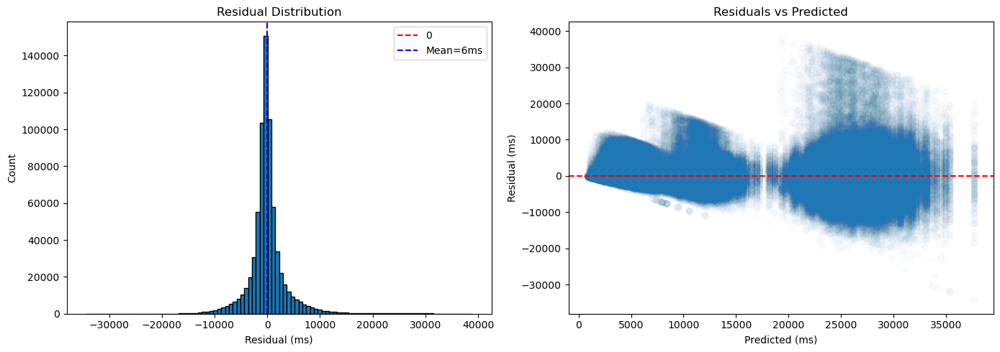
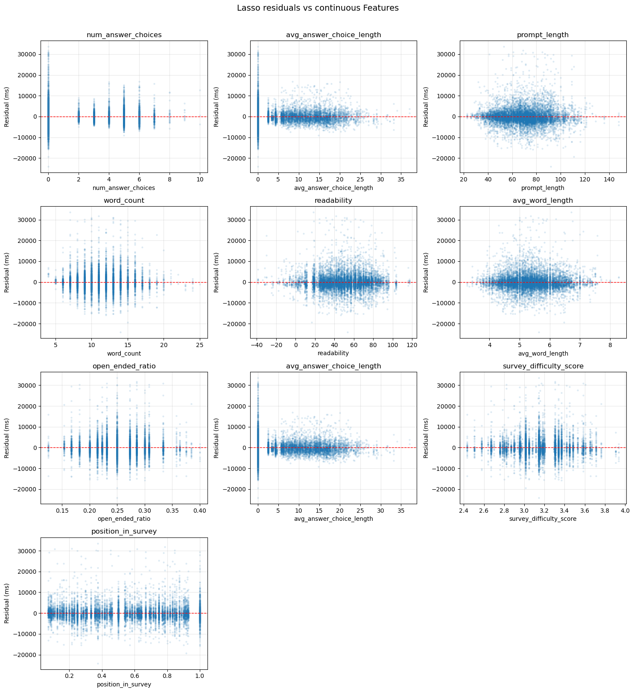
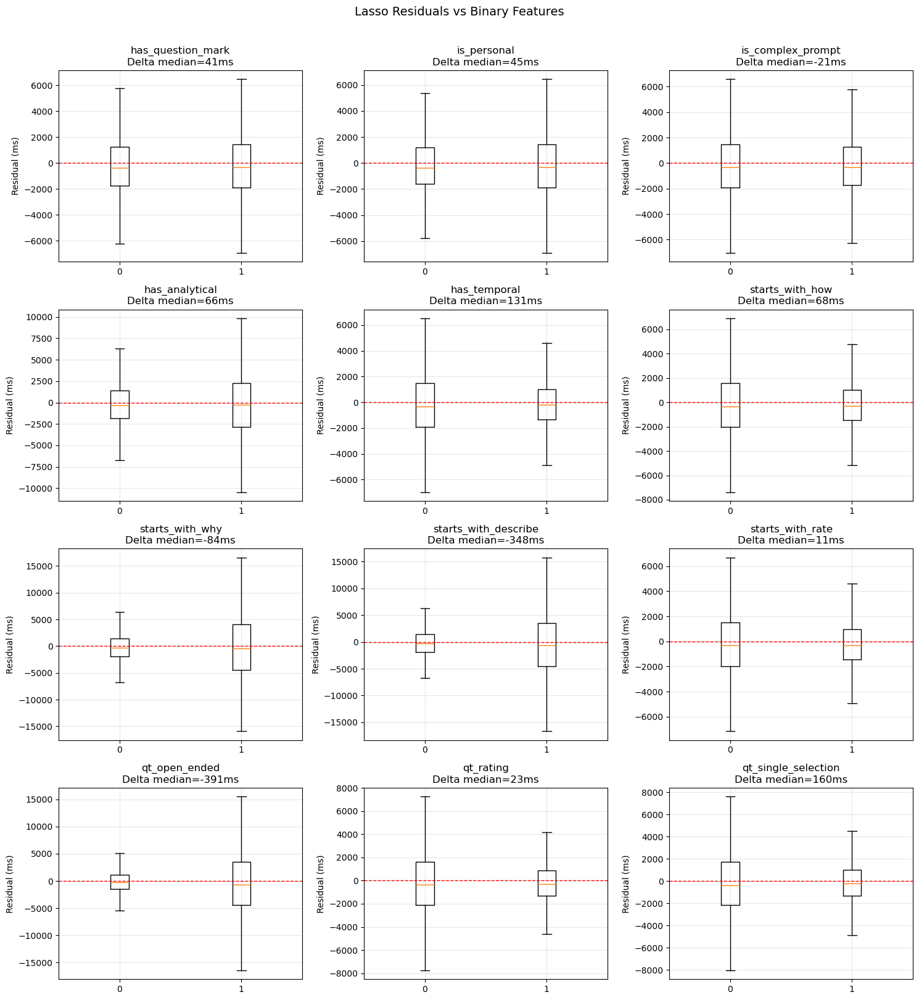
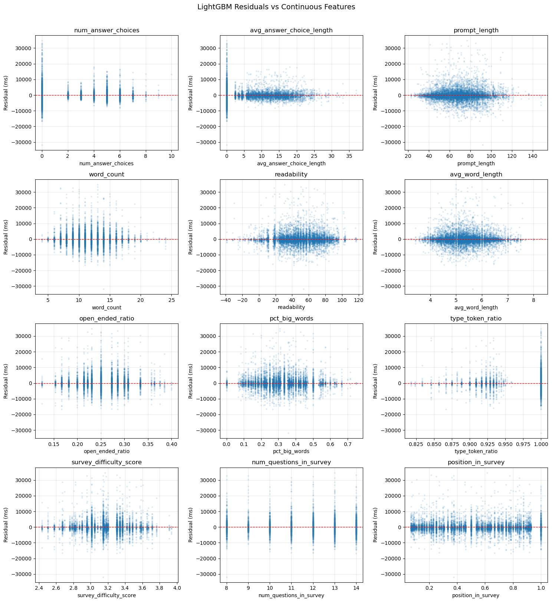
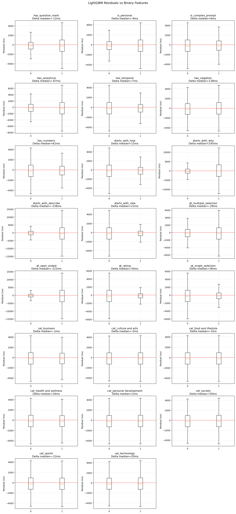

# LOI Prediction — Solution Documentation

---

## 1. Problem Description

Accurately estimating the Length of Interview (LOI) is a critical capability for modern survey platforms. LOI directly impacts user engagement, completion rates, and probably growth of companies and overall data quality—users are significantly more likely to abandon surveys when perceived duration exceeds expectations.

The challenge is that LOI must be estimated *before* any user has responded.
This rules out approaches that rely on historical response data for that
specific survey, and requires building a model that generalises to new,
unseen surveys based only on their structure and content.

To address this, we reformulate the problem as a bottom up prediction task, where we estimate the expected time to answer each question (answer_time_ms) and aggregate these predictions to compute the survey's LOI. This granular approach enables the model to learn behavioral patterns at the question level, which are more transferable across surveys than coarse survey level averages.

As I have seen from previous papers and articles mentioned in the last part of this documentation, response time is not a clean measurement of cognitive effort .It is anoisy behavioural signal shaped by a complex mix of structural, cognitive,
and individual factors. Fernández-Fontelo et al. (2021) establish that response time is a form of paradata, reflecting the respondents state and interaction with the interface as much as the question itself. Their work shows that even within fixed question formats, individual differences are substantial enough that user level signals (mouse movements) improve prediction beyond question level features. From a feature perspective, Yousefpoori-Naeim et al. (BEA 2024) demonstrate across medical examination items that response time prediction is primarily driven by length-related features — word count and item length — while cohesion-based, semantic, and embedding-based features contribute minimally once length is accounted for. Both works converge on the same structural observation: response time distributions are right-skewed and heavy-tailed, with a cluster of implausibly fast responses at the lower end (bots, random clicking) and extreme outliers at the upper end (abandoned sessions, idle time) that must be handled explicitly before modeling. Retaining these without treatment distorts the loss function and the learned feature-target relationship. 

These findings directly informed three decisions in this project: using type-specific, data driven outlier thresholds rather than a global rule centering the feature set on length and structural properties rather than semantic embeddings and interpreting the open-ended prediction ceiling as a data- vailability constraint — individual user behaviour cannot be recovered from question-level features alone — rather than a modeling failure.

## 2. Dataset

The dataset is a PostgreSQL relational database with four tables:

| Table | Rows | Description |
|---|---|---|
| `survey` | 331 | Survey metadata: topic, category, created_at |
| `question` | 3,683 | Per-survey questions: type, prompt, order, max_rating |
| `answer` | 8,942 | Predefined answer options for selection-type questions |
| `survey_response` | 4,453,200 | User responses: response_id, question_id, answer_time_ms |

Key observations from table-level EDA:

- `max_rating` nulls are expected — only rating questions use it
- `answer` table only contains rows for selection questions; open_ended
  and rating produce NULLs on join which where handled with `fillna(0)`
- Every survey contains all four question types
- No duplicate `(response_id, question_id)` pairs — one answer per question per user. 

---

## 3. Exploratory Data Analysis

### 3.1 Answer Time Distribution

The raw `answer_time_ms` distribution is heavily **right-skewed**:

- Mean: 12,554ms vs Median: 7,210ms — the gap signals extreme values
- Skewness ≈ 6 across all question types
- Min: 0ms — bot responses / automated clicks
- Max: 622,674ms (~10 minutes) — user left the browser open

This skewness has direct consequences:
1. The standard 1.5×IQR rule for outliers is too aggressive on skewed data thus i tried 3xIQR
2. The mean is not a reliable comparison statistic. medians are used throughout the analysis due to skeweness
3. Log-transforming the target was tested but ultimately rejected (Section 5.1)

### 3.2 Bimodal Distribution and Outlier Strategy

Histograms of `answer_time_ms` per question type revealed a **bimodal
distribution**: a sharp peak at very low values (bot/invalid responses)
followed by a broader peak of legitimate behaviour. this indicates that sum users answered randomly or as a bot thus treated as outliers.

**Lower bounds** were identified using `scipy.signal.argrelmin` on the
histogram counts (`order=5`). This automatically finds the valley between
the two modes without manual threshold setting:

| Question Type | Lower Bound |
|---|---|
| open_ended | 3,989ms |
| single_selection | 1,009ms |
| multiple_selection | 1,929ms |
| rating | 734ms |

**Upper bounds** used Q3 + 3×IQR per question type, computed after applying
lower bounds. The rationale for 3× rather than the standard 1.5× is the
residual skewness with skewed data, 1.5×IQR removes too many rows that could actually represent slow answers.

| Question Type | Upper Bound | % Removed |
|---|---|---|
| open_ended | 58,502ms | 1.31% |
| single_selection | 15,189ms | 1.11% |
| multiple_selection | 26,903ms | 1.11% |
| rating | 13,768ms | 0.55% |

Total removed: ~14.4%. Cleaned dataset: 3.8M rows.

### 3.3 Answer Time by Question Type

After cleaning, medians confirm the expected hierarchy:

| Question Type | Median | Interpretation |
|---|---|---|
| open_ended | 25,621ms (~25 sec) | User must type a free-text response |
| multiple_selection | 10,872ms (~11 sec) | Read, evaluate, and select multiple |
| single_selection | 5,190ms (~5 sec) | Read and select one option |
| rating | 3,600ms (~4 sec) | Single click on a scale |

The Pearson correlation of `qt_open_ended` with `answer_time_ms` is **0.86**
— the strongest predictor in the dataset. This means the simplest possible
model (median per type) already captures 81% of the variance, setting a
strong baseline.

### 3.4 Survey Fatigue Investigation

A zigzag pattern in median answer time vs question order suggested potential
fatigue. Before treating position as a fatigue feature, the hypothesis was
tested via a pivot table of question type counts by order position.

Result: open_ended questions cluster at positions 3, 7, 11 and rating at
positions 4, 8, 12. Analysing median time *within* each type by position
shows no upward trend.

**Conclusion:** The zigzag is entirely explained by question type rotation,
not fatigue. `position_in_survey` was retained as a normalised (0–1) context
feature but not as a fatigue proxy.

### 3.5 Category Analysis

87 raw categories were reduced to 8 broad groups. Two grouping methods
were compared:

- **MiniLM cosine similarity:** 24/90 errors (27%) on domain-specific terms
  (indycar → technology, motogp → business) thus got rejected
- **Manual mapping:** with the help of open source llms.

### 3.6 Correlation Analysis

To better understand the relationship between survey features and response time (answer_time_ms), we conducted a combination of correlation analysis and residual diagnostics. Given the behavioural nature of the problem and the known characteristics of response time data, particular attention was paid to non-linearity, distributional skewness, and model misspecification.

## 4. Feature Engineering

### 4.1 Technical Approach

The full 4.4M-row dataset was processed using **chunk processing**
(chunksize=200,000). Outlier filtering was embedded in the SQL query,
so only clean rows are loaded into memory.

Survey level and answer level features were computed via SQL *before*
the chunk loop and merged per chunk. This is critical: if survey-level
aggregations (e.g., question counts per type) were computed inside the
loop, a survey split across two chunks would produce incorrect counts.

### 4.2 Features (35 total)

**Question type OHE (4):** One-hot encoded. These carry the dominant signal
(qt_open_ended corr=0.86).

**Prompt linguistics (14):** Computed row-by-row in the chunk loop.

| Feature | Rationale |
|---|---|
| `word_count` | Reading time scales with length — top non-type feature in BEA 2024 |
| `prompt_length` | Character-level complement to word_count |
| `avg_word_length` | Vocabulary complexity; non-linear signal (corr=-0.04, importance=201ms) |
| `pct_big_words` | % words ≥7 chars — polysyllabic density |
| `type_token_ratio` | Lexical diversity — more varied = more cognitive load |
| `readability` | Flesch Reading Ease (textstat) |
| `has_question_mark` | Format signal |
| `is_personal` | Contains 'you/your' — personal framing |
| `has_analytical` | Contains if/because/compare/analyze |
| `has_negation` | Cognitive load from negative framing |
| `has_temporal` | Frequency words (usually/often) → familiar format → faster |
| `has_numbers` | Numeric context |
| `is_complex_prompt` | Contains why/how/describe/explain |
| `starts_with_why/how/describe/rate` | First-word intent proxies |

**Answer choice (2):** From answer table SQL aggregation.
`avg_answer_choice_length` is NULL for open_ended/rating → filled with 0.

**Survey context (4):** Computed post-concat on full dataframe.

| Feature | Rationale |
|---|---|
| `position_in_survey` | order / n_questions, normalised 0–1 |
| `open_ended_ratio` | Proportion of open_ended in survey |
| `num_questions_in_survey` | Survey length |
| `survey_difficulty_score` | Weighted sum of question type counts (see below) |

**Survey difficulty score:**

```
difficulty = (n_open × weight n open + n_multiple × weight n multiple +
              n_single × weight n single + n_rating × weight n rating) / n_questions
```

Weights = training median per type / minimum median. This is preferable
to individual `num_*_questions` columns because it reduces dimensionality
and encodes the *relative* cost of each type in a single interpretable number.

**Category OHE (8):** Broad group membership. Permutation importance 8–14ms.

### 4.3 Features Excluded

| Feature | Reason |
|---|---|
| `survey_id` | 331 unique values — would not generalise to new surveys |
| `order` | Replaced by normalised `position_in_survey` |
| `category` (raw) | 87 values — replaced by 8-group OHE |
| `max_rating` | Permutation importance ≈ 0ms |
| `num_*_questions` per type | Redundant with `survey_difficulty_score` |
| `created_at` | Timestamp of creation, not of user response |
| BERT embeddings | 0ms improvement in experiments (Section 7.2) |
| `sentiment_polarity` | Pearson ~0.01; no practical signal |

---

#### Correlation Analysis: Pearson vs Spearman

We evaluated feature–target relationships using both Pearson and Spearman correlation coefficients to capture complementary aspects of dependency. 
- Pearson correlation measures linear relationships and is sensitive to outliers.
- Spearman correlation captures monotonic relationships and is more robust to non-normality and extreme values.

The comparison between the two revealed several important patterns:

- Features such as qt_open_ended, qt_rating, and qt_single_selection exhibited strong and consistent correlations across both metrics, indicating clear and stable relationships with response time. For instance, open ended questions were strongly associated with longer response times, while rating and single selection questions were consistently faster.
- In contrast, features like num_answer_choices and qt_multiple_selection showed notable discrepancies between Pearson and Spearman coefficients, suggesting the presence of non-linear or non-monotonic effects. This indicates that the impact of these features on response time is more complex than a simple linear trend.
- The majority of features demonstrated weak correlations overall, reinforcing the assumption that response time is driven by a combination of subtle, interacting factors rather than strong univariate relationships.

These findings highlight that linear correlation alone is insufficient to fully capture the structure of the data, and that more flexible modelling approaches may be required.

---

## 5. Modeling

### 5.1 Setup

**Train/test split at response_id level** (80/20, random_state=42). Splitting
at row level would be a leakage error: questions from the same user would
appear in both train and test. Splitting by response_id ensures complete
isolation — confirmed with overlap check = 0.

- Train: 2,888,485 rows / 306,052 response IDs
- Test: 721,925 rows / 76,514 response IDs

**No log transform on the target.** Tested both:
- Raw: MAE = 2,645ms ✓
- log1p → expm1: MAE = 2,673ms

After outlier removal, the residual skewness no longer causes enough
instability to justify the added complexity. Raw milliseconds also make
model errors directly interpretable.

### 5.2 Baseline

Predicts training set median per question type. This is the strongest
"no-information" model — it uses only question type and predicts the same
value for all questions of that type.

**Results:** MAE = 2,767ms, R² = 0.8125

The R² of 0.81 quantifies how much variance question type alone explains.
Any ML model must demonstrably exceed this to justify its complexity.

### 5.3 Lasso

L1-regularised linear regression. Selected because:
1. BEA 2024 ranks it as the 2nd best model for response time prediction
2. L1 penalty provides implicit feature selection (zeros irrelevant coefficients)
3. Coefficients are directly interpretable in milliseconds

**Feature selection before fitting:** Not all 35 features were passed to
Lasso. Pearson and Spearman correlations from EDA were used to pre-filter.
Drop criteria: (a) both P≈0 and S≈0 — no signal at all; (b) S>>P —
non-linear monotonic signal only, which Lasso cannot capture by design.

| Feature dropped | Reason |
|---|---|
| `qt_multiple_selection` | P=-0.03, S=0.21 — non-linear only, kept for LightGBM |
| `pct_big_words` | P=-0.01, S=-0.06 — near zero on both |
| `type_token_ratio` | P=-0.05, S=-0.02 — near zero, correlated with word_count |
| `has_negation` | P=0.01, S=0.00, Δmedian=1130ms — no signal |
| `has_numbers` | P=-0.06, S=-0.06 — too small for linear model |
| `num_questions_in_survey` | P=0.01, S=0.01 — already captured by difficulty_score |
| `cat_*` (all 8) | P≈0, S≈0, Δmedian < 700ms — no signal for linear model |

Borderline features (`avg_word_length`, `is_complex_prompt`,
`position_in_survey`, `max_rating`) were retained and left for the Lasso
regularisation to decide.

**Alpha tuning:** LassoCV on a 1M-row subsample (memory constraint — full
train is 2.8M rows). The scaler was fit on the same subsample used for CV
to maintain consistency, then applied to the full train and test sets.
30 alpha values log-spaced between 1e-4 and 10. Best alpha: 0.0079.

**Cross-validation:** 5-fold GroupKFold on the full training set, grouping
by `response_id`. This mirrors the train/test split logic — a user's
responses never appear in both train and validation folds.

| Fold | MAE | R² |
|---|---|---|
| 1 | 2,623ms | 0.8272 |
| 2 | 2,620ms | 0.8279 |
| 3 | 2,620ms | 0.8282 |
| 4 | 2,626ms | 0.8276 |
| 5 | 2,625ms | 0.8276 |
| **Mean** | **2,623 ± 3ms** | **0.8277 ± 0.0003** |

Std of 3ms confirms the result is stable and not a lucky split.

**Coefficient analysis:**


Question types dominate — `qt_open_ended` (+6,301ms) is by far the most
important feature, consistent with Pearson=0.86 from EDA. `qt_rating`
(-3,261ms) and `qt_single_selection` (-2,606ms) confirm that click-based
questions are significantly faster.

`prompt_length` (+1,405ms) is the second most important feature after
question types, consistent with BEA 2024's finding that length-related
features are the primary predictors of response time.

Multicollinearity is visible in the `prompt_length` / `word_count` /
`avg_word_length` trio: prompt_length is positive (+1,405ms) while
word_count (-290ms) and avg_word_length (-650ms) are both negative.
The signs are not individually interpretable — Lasso is splitting the
effect across correlated features. This is a known L1 artefact with
highly correlated inputs; the combined effect is what matters, not the
individual signs.

`open_ended_ratio` is negative (-188ms) despite an expected positive
direction. This is a correction term — `qt_open_ended` already captures
the main effect, and the ratio provides a secondary adjustment for surveys
with higher proportions of open-ended questions once type is accounted for.

Borderline features were validated: `position_in_survey` (3ms) and
`starts_with_why` (-5ms) were effectively zeroed out by regularisation,
confirming the EDA finding of near-zero signal. `is_complex_prompt` (58ms)
survived with a small coefficient, consistent with its borderline status.

**Results:** MAE = 2,623ms, R² = 0.8277 (+5.2% vs baseline)

### 5.4 LightGBM

Tree-based gradient boosting. Selected for its ability to capture non-linear
relationships and feature interactions without requiring feature scaling,
and its efficiency on large tabular datasets.

**Structured comparison — three experiments:**

To isolate where the performance gain comes from, LightGBM was evaluated
in three configurations before final tuning:

| Model | MAE | R² | Gain |
|---|---|---|---|
| Lasso (lasso_features) | 2,623ms | 0.8277 | baseline for comparison |
| LightGBM (lasso_features, default) | 2,407ms | 0.8453 | +8.4% — algorithm gain |
| LightGBM (all features, default) | 2,382ms | 0.8470 | +1.0% — feature gain |
| LightGBM (all features, tuned) | 2,182ms | 0.8566 | +8.4% — tuning gain |

Running LightGBM on the same features as Lasso first isolates the algorithm
contribution from the feature contribution. The 8.4% gain from the algorithm
alone comes from capturing interactions between question type and prompt-level
features that Lasso cannot model by design. The 1.0% additional gain from
extra features is primarily from `qt_multiple_selection` (S=0.21, P=-0.03
— non-linear signal invisible to Lasso).

**Hyperparameter tuning with Optuna (100 trials, 1M-row subsample):**

Due to RAM and time constraints, tuning ran on a 1M-row subsample of the
2.8M training set. Each trial uses a fresh random subsample (`seed=trial.number`)
to reduce the risk of overfitting to a specific subset. Early stopping
(patience=50) prevents training trees that no longer improve validation MAE.

Optuna uses Bayesian optimisation (Tree-structured Parzen Estimator) —
each trial uses information from previous results to focus on promising
regions, unlike grid search.

Best params:
```
n_estimators=695, learning_rate=0.149, num_leaves=145, max_depth=9,
min_child_samples=11, subsample=0.526, colsample_bytree=0.736,
reg_alpha=0.003, reg_lambda=1.16e-5
```

**Cross-validation with best params:** 5-fold GroupKFold on the full
training set (2.8M rows) confirmed the params found on the subsample
generalise well.

| Fold | MAE | R² |
|---|---|---|
| 1 | 2,183ms | 0.8558 |
| 2 | 2,182ms | 0.8561 |
| 3 | 2,180ms | 0.8568 |
| 4 | 2,182ms | 0.8562 |
| 5 | 2,184ms | 0.8561 |
| **Mean** | **2,182 ± 1ms** | **0.8562 ± 0.0003** |

Std of 1ms across folds confirms exceptional stability.

**Final training:** Full 2.8M-row training set with best params and early
stopping evaluated on test set.

**Results:** MAE = 2,182ms, R² = 0.8566 (+21.1% vs baseline, +16.8% vs Lasso)

### 5.5 Model Comparison

| Model | MAE | R² | vs Baseline |
|---|---|---|---|
| Baseline | 2,767ms | 0.8125 | — |
| Lasso (lasso_features) | 2,623ms | 0.8277 | +5.2% |
| LightGBM (lasso_features, default) | 2,407ms | 0.8453 | +13.0% |
| LightGBM (all features, default) | 2,382ms | 0.8470 | +13.9% |
| **LightGBM (all features, tuned)** | **2,182ms** | **0.8566** | **+21.1%** |

The structured comparison isolates three independent sources of gain:
algorithm (+8.4%), features (+1.0%), and tuning (+8.4%). Each contributes
roughly equally, confirming the progression is meaningful rather than a
result of a single dominant factor.

---

## 6. Statistical Evaluation

### 6.1 Cross Validation

5-fold **GroupKFold** CV on 1M-row subsample from training set.
GroupKFold preserves response_id isolation across folds.

| Fold | MAE | R² |
|---|---|---|
| 1 | 2,189ms | 0.8556 |
| 2 | 2,187ms | 0.8571 |
| 3 | 2,184ms | 0.8561 |
| 4 | 2,184ms | 0.8562 |
| 5 | 2,185ms | 0.8552 |
| **Mean** | **2,186 ± 2ms** | **0.8560 ± 0.0007** |

Two conclusions:

1. **Stability:** std = 2ms relative to mean of 2,186ms (CV = 0.09%).
   The model produces consistent results regardless of which users are held out.

2. **No overfitting:** CV MAE (2,186ms) ≈ test MAE (2,182ms), difference
   of 4ms. If the model had overfit, CV MAE would substantially exceed test MAE.

### 6.2 LOI Evaluation (Survey Level)

Predictions were aggregated to survey level by summing predicted and actual
`answer_time_ms` per `(response_id, survey_id)` pair, and regression metrics
were computed on these totals.

| Metric | Value |
|---|---|
| MAE | 8,800ms (8.8 sec) |
| RMSE | 11,500ms (11.5 sec) |
| R² | 0.864 |
| Mean actual LOI | 111,154ms (111 sec) |
| Mean predicted LOI | 111,194ms (111 sec) |
| Bias | +40ms |



**Observations:**

- **Unbiased at survey level:** mean predicted = mean actual to within 40ms.
  This is the critical business metric — a biased model would systematically
  mis-represent survey duration.

- **R² improves from 0.857 to 0.864 at survey level.** Random errors across
  individual questions partially cancel when summed — aggregation reduces noise.

- **7.9% relative error:** LOI MAE of 8.8 sec on a mean survey of 111 sec.
  For a platform showing "this survey takes ~2 minutes," the prediction is
  typically accurate to within ±9 seconds.

### 6.3 Residual Analysis

Residuals were analysed separately for Lasso and LightGBM, both against
continuous and binary features, to identify systematic misspecification
and understand where each model's remaining error originates.

**Lasso — Continuous features:**



The variance pattern across all features reflects the question type
distribution at each value of x, not missing non-linear signal.
`num_answer_choices=0` contains both open_ended and rating questions —
the two extremes of response time — causing high variance at 0 that
narrows as the mix becomes more homogeneous. This is inherent data
structure, not a model limitation. `prompt_length`, `word_count`,
`readability`, and `avg_word_length` all show symmetric scatter with
no pattern — well modelled by the linear fit.

**Lasso — Binary features:**



No systematic bias across any feature. The two largest deviations —
`qt_open_ended` (Δmedian=-391ms) and `starts_with_describe` (Δmedian=-348ms)
— reflect natural user-level variability in open_ended responses, not
model misspecification. `qt_rating` (Δmedian=23ms) and `qt_single_selection`
(Δmedian=160ms) are effectively unbiased.

**LightGBM — Continuous features:**



Residual patterns are almost identical to Lasso. The variance pattern in
`num_answer_choices` and `avg_answer_choice_length` remains unchanged —
LightGBM does not correct it despite the high permutation importance of
`avg_answer_choice_length` (922ms). This confirms the pattern is driven by
question type distribution, not by non-linear signal the model is missing.
One new pattern: `type_token_ratio` shows high variance at 1.0, likely
from very short prompts where every word is unique.

**LightGBM — Binary features:**



LightGBM shows meaningful improvement over Lasso in two areas:
`qt_open_ended` bias reduced from -391ms to -222ms, and `qt_multiple_selection`
(Δmedian=-29ms) is effectively unbiased — validating the decision to include
it only for LightGBM. Two regressions worth noting: `starts_with_why` bias
increased from -84ms to +245ms, likely because the feature is too sparse for
the trees to learn reliably; `has_negation` shows a new bias of 138ms despite
near-zero permutation importance, suggesting a subtle interaction with other
features. All `cat_*` features remain below 30ms Δmedian.

**Global statistics (LightGBM):** Mean residual = -6ms (unbiased),
Median = -249ms, Std = 3,716ms.

**Per question type:**

| Type | Mean residual | Std |
|---|---|---|
| open_ended | +1ms | 6,465ms |
| multiple_selection | -17ms | 2,934ms |
| single_selection | -8ms | 1,669ms |
| rating | +9ms | 1,493ms |

All mean residuals within ±17ms — no systematic bias in any type.

**Overall conclusion:** Neither model shows evidence of systematic
misspecification. The remaining error is driven by inherent user-level
variability — particularly in open_ended responses — that cannot be
captured from question-level features alone. LightGBM's gain over Lasso
comes primarily from better modelling of `qt_open_ended` and capturing
`qt_multiple_selection`, not from correcting non-linearity in continuous
features.

### 6.4 Permutation Importance

Computed on 50k test samples, 10 repeats. Each feature is randomly shuffled
and the MAE increase is recorded — a model-agnostic measure of feature
contribution in interpretable units (ms).

| Feature | MAE gain (ms) | Note |
|---|---|---|
| qt_open_ended | 3,868 | Dominant by far — consistent with Lasso coefficient (+6,301ms) |
| qt_rating | 1,212 | |
| avg_answer_choice_length | 922 | 3rd most important — near-zero in Lasso (74ms): non-linear relationship |
| qt_multiple_selection | 524 | Dropped from Lasso (P=-0.03); non-linear signal (S=0.21) |
| qt_single_selection | 329 | |
| word_count | 277 | Top non-type feature; BEA 2024 confirmed |
| avg_word_length | 187 | Pearson=-0.04 — invisible to correlation, captured by LightGBM |
| readability | 182 | |
| prompt_length | 177 | |
| position_in_survey | 96 | |
| starts_with_rate | 93 | |
| num_answer_choices | 90 | |
| pct_big_words | 86 | Pearson=-0.01 — non-linear signal via interactions |
| starts_with_how | 65 | |
| survey_difficulty_score | 51 | |
| has_negation | -0.08 | Only negative importance — effectively zero |

`avg_word_length` (corr=-0.04, importance=187ms) and `pct_big_words`
(corr=-0.01, importance=86ms) show meaningful importance despite near-zero
Pearson correlation — a direct demonstration of why correlation alone should
not drive feature exclusion for non-linear models.

The gap between Lasso and LightGBM in `avg_answer_choice_length` (74ms vs
922ms) and the inclusion of `qt_multiple_selection` (524ms) largely explains
the 8.4% MAE gain from the algorithm: LightGBM recovers non-linear signal
that Lasso treats as noise or confounded with question type.

---

## 7. Future Work

### 7.1 Log Transform on Lasso Target

The target `answer_time_ms` remains right-skewed after outlier removal
(skewness approx 5). A log transform was tested on LightGBM and rejected — after
cleaning, the residual skewness does not cause enough instability to justify
the added complexity, and raw milliseconds keep model errors directly
interpretable.

For Lasso the case is different. Lasso assumes homoscedastic errors — equal
variance across the full range of predictions. The residual analysis shows
this holds reasonably well, but open_ended questions (mean 25,621ms, std
7,038ms) carry disproportionate weight in the MSE loss that LassoCV
minimises internally. A log transform would rebalance this, giving rating
and single_selection questions more influence during fitting.

The test would be straightforward: fit LassoCV on `log1p(y)` using a fresh
alpha grid (the optimal alpha changes substantially with a different target
scale), back-transform predictions with `expm1`, and compare MAE on the
original scale. If the gain is meaningful it would also sharpen the
coefficient interpretation — currently the multicollinearity between
`prompt_length`, `word_count`, and `avg_word_length` is partly amplified
by open_ended responses dominating the loss. A log transform may produce
cleaner, more stable coefficients for these three features.

### 7.2 Stratified Modeling

The residual analysis shows that open_ended questions drive most of the
remaining error — MAE of 4,685ms vs 887ms for rating. The variance within
open_ended (std=7,038ms) is more than 3× that of any other type, and the
stratified experiment in Section 7.1 confirmed that 84% of this variance
is unexplained by question-level features alone.

A natural next step is a stratified pipeline where a separate model is
trained per question type, rather than a single model with type OHE as
features. The argument for this is that the optimal feature set and
hyperparameters likely differ across types — for open_ended, prompt
complexity features (word_count, readability, starts_with_describe) are
the only available signal; for rating and single_selection, answer choice
features (num_answer_choices, avg_answer_choice_length) dominate. A single
model is forced to find a compromise across these very different subproblems.

The practical constraint is the open_ended ceiling — without user-level
features, no question-level model can meaningfully improve beyond the
current 4,685ms MAE regardless of architecture. The more promising
direction for open_ended specifically would be adding user history features
(e.g. median response time from previous surveys for that user) if the
platform can make these available at prediction time.


**Individual user variance:** The ceiling on open_ended prediction (R²=0.16)
is a data availability limitation, not a modeling one. Without user-level
history at prediction time, the variance from individual writing behaviour
cannot be captured.

**Tuning on subsample:** Optuna ran on 500k rows (full training: 3.8M).
Parameters optimal for a subset may not be fully optimal for the complete
dataset. The CV stability (±2ms) suggests the found parameters generalise
well.

**Upper bound (3×IQR):** Worst predictions are open_ended responses near
the 58,502ms threshold — the model has little training signal at this range.
4×IQR could reduce tail errors but risks retaining more "abandoned session"
noise. This is an explicit trade-off.

---

## 8. References

- Tack et al. (2024). *BEA Shared Task on Automated Prediction of Item
  Difficulty and Response Time.* ACL Anthology.
  → Confirmed Lasso as a strong baseline; confirmed BERT embeddings add
  minimal value; informed feature engineering structure.

- Schneider et al. (2022). *Using Attributes of Survey Items to Predict
  Response Times.* Field Methods, 35(2), 87–99.
  → Confirmed question format, word count, and response scale as primary
  predictors; referenced for feature selection rationale.
